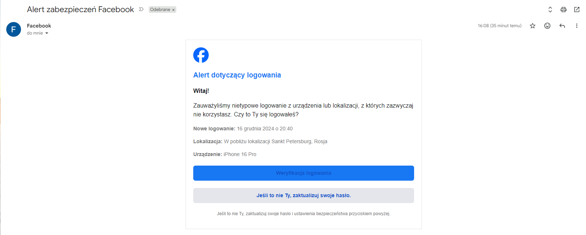
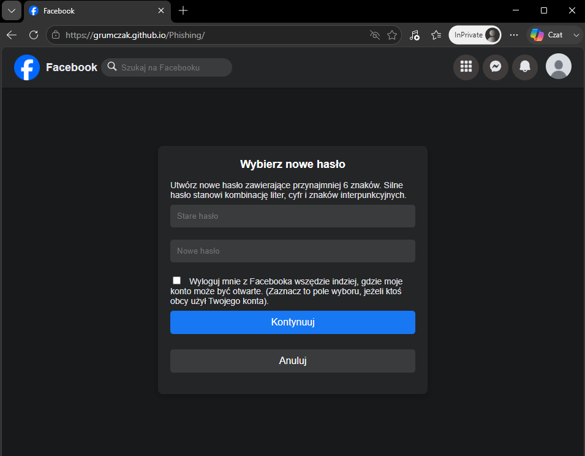
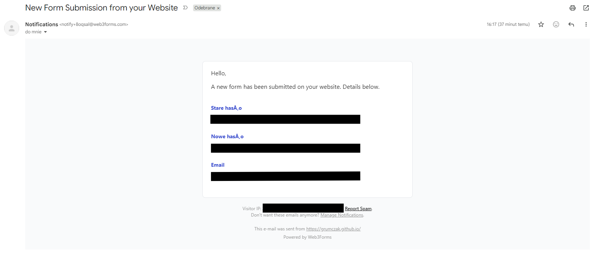

# Facebook phishing campaign

I intended to create a simple phishing campaign infrastructure that would allow to send a malicious emails to the victim and harvest their credential to the desired service - in this example it is Facebook.

## How it works

* The attacker sets up his credentials - email and password - in index.js file.
* The attacker provides a list of victims in recipients.json file.
* The attacker sends a message to the victim(s) by running the index.js file.
* Every victim receives the falsified warning regarding their unexpected login. There are however some limitations enforced by Google when it comes to formatting HTML embedded links, so the look of the message is not perfect. 
   
* Once victim clicks the button to reset their password - the malicious website opens up to capture their credentials (email is taken from the URL and old and new passwords - from the form). 
   

* Thanks to the Web3Forms API, an attacker gets the victims' credentials straight into their email. 
  

 
And there we have it!

## Constraints

While interacting with this project keep in mind the following:

* It has been made for curiosity/education purposes only - do not use it in an unethical way, please!
* As I mentionted earlier, Google formats some HTML, so it was impossible for me to make the links in the email appear as non-blue.
* A real phishing scenario would also involve setting up a fresh email with the appropriate name (e.g. support etc.), and photo connected with Facebook or Meta.
* If you would like to set it up yourself, keep in mind that you would have to set up your own Web3Forms form and send POST requests there - otherwise all credentials are going to land in my email box :)
